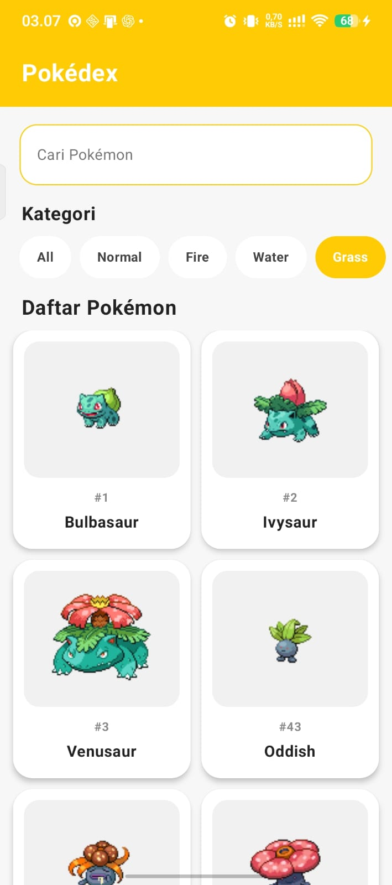
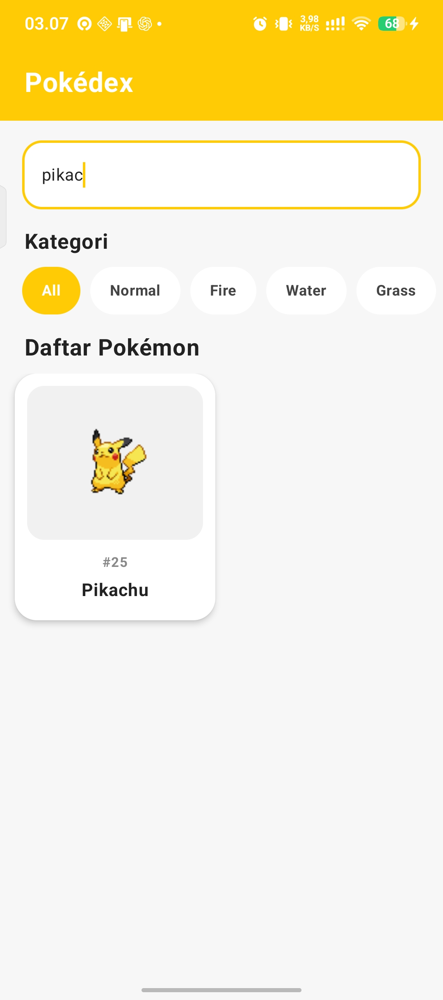
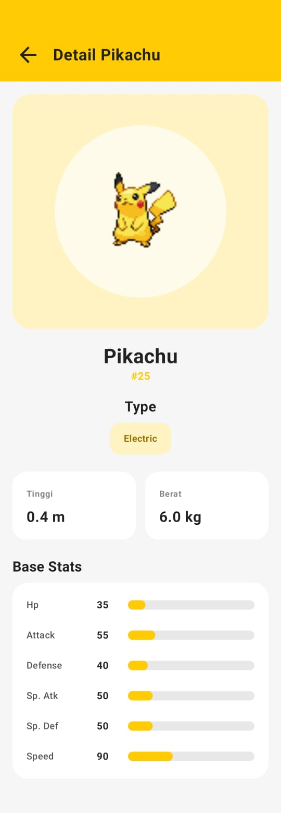

# Pokédex - Aplikasi Katalog dan Eksplorasi Pokémon
> Aplikasi katalog dan eksplorasi Pokémon berbasis Android menggunakan Jetpack Compose dan PokéAPI.

---

## 👤 Identitas Praktikan

- **Nama Lengkap:** Ermas Muhammad Syatafa
- **NIM:** H1D024030
- **Shift Awal:** A
- **Shift Akhir:**  C
- **Link Video Demo/Penjelasan:** https://youtu.be/I-EoiZqzXOc?si=Xl5BPLh309_7G99d

---

## 📱 Deskripsi Aplikasi

Pokédex merupakan aplikasi Android yang digunakan untuk melihat dan mengeksplorasi informasi mengenai Pokémon. Aplikasi ini mengambil data secara langsung dari **PokéAPI** dan menampilkannya dalam bentuk katalog yang sederhana dan mudah digunakan.

Pengguna dapat melihat daftar Pokémon, melakukan pencarian berdasarkan nama, memfilter Pokémon berdasarkan tipe, serta membuka halaman detail untuk melihat informasi yang lebih lengkap seperti ID, tipe, tinggi, berat, dan statistik Pokémon.

Aplikasi dikembangkan menggunakan **Kotlin** dan **Jetpack Compose** dengan menerapkan pola arsitektur **MVVM (Model-View-ViewModel)**.

---

## 🛠️ Penjelasan Teknis

### 1. Spesifikasi & Tech Stack

- **Bahasa:** Kotlin (Bahasa pemrograman utama)
- **UI Framework:** Jetpack Compose (Framework UI deklaratif dengan Material 3)
- **Min SDK:** 29 (Android 10)
- **Target SDK:** 37 (Android 17)
- **Pola Arsitektur:** MVVM (Model-View-ViewModel)
- **Networking:** Retrofit (Komunikasi dengan REST API)
- **JSON Converter:** Gson Converter (Konversi response JSON ke data class Kotlin)
- **Image Loading:** Coil (Memuat gambar Pokémon dari URL)
- **State Management:** StateFlow (Pengelolaan state UI)
- **Asynchronous Processing:** Kotlin Coroutines (Menjalankan proses asynchronous)
- **API:** PokéAPI (Sumber data Pokémon)

### 2. Fitur Utama

- **Katalog Pokémon:** Menampilkan daftar Pokémon yang diperoleh dari PokéAPI dalam bentuk grid.
- **Pencarian Pokémon:** Memungkinkan pengguna mencari Pokémon berdasarkan nama.
- **Filter Tipe:** Menampilkan Pokémon berdasarkan tipe yang dipilih.
- **Detail Pokémon:** Menampilkan informasi lengkap Pokémon berupa gambar, nama, ID, tipe, tinggi, berat, dan statistik.
- **Loading State:** Menampilkan kondisi loading ketika aplikasi sedang mengambil data dari API.
- **Error State:** Menampilkan informasi ketika terjadi kesalahan dalam proses pengambilan data.
- **Navigasi Detail:** Pengguna dapat memilih Pokémon dari katalog untuk melihat halaman detailnya.

### 3. Struktur Direktori Proyek

```text
app/src/main/java/com/ermasmuhammad/pokemon/
├── data/
│   ├── api/
│   │   ├── PokeApiService.kt
│   │   └── RetrofitClient.kt
│   │
│   ├── model/
│   │   ├── Pokemon.kt
│   │   ├── PokemonListResponse.kt
│   │   ├── PokemonListItem.kt
│   │   ├── PokemonSprites.kt
│   │   ├── PokemonType.kt
│   │   └── PokemonStat.kt
│   │
│   └── repository/
│       └── PokemonRepository.kt
│
├── ui/
│   ├── screen/
│   │   ├── HomeScreen.kt
│   │   └── PokemonDetailScreen.kt
│   │
│   ├── state/
│   │   ├── PokemonUiState.kt
│   │   └── PokemonDetailUiState.kt
│   │
│   ├── theme/
│   │   ├── Color.kt
│   │   ├── Theme.kt
│   │   └── Type.kt
│   │
│   └── viewmodel/
│       ├── HomeViewModel.kt
│       └── DetailViewModel.kt
│
└── MainActivity.kt
```

---

## 📸 Tangkapan Layar (Screenshots)

| Home Screen | Search Pokémon | Detail Pokémon |
|:---:|:---:|:---:|
|  |  |  |


---

## 🚀 Cara Menjalankan Proyek

1. **Prasyarat:**
    - Android Studio (Koala / Ladybug / versi terbaru disarankan).
    - JDK 17 atau lebih baru.
    - Perangkat fisik Android dengan USB Debugging aktif atau Emulator (API level disesuaikan).

2. **Langkah:**
   ```bash
   # Clone repository
   git clone <URL_REPOSITORY>
   ```
3. Buka folder proyek di **Android Studio**.
4. Tunggu proses **Gradle Sync** selesai.
5. Pilih target perangkat/emulator, lalu klik tombol **Run (`Shift + F10`)**.
6. Pastikan koneksi internet aktif.
